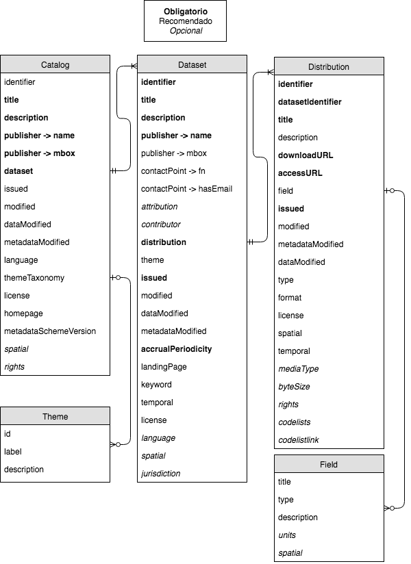

Reference
===

<!-- START doctoc generated TOC please keep comment here to allow auto update -->
<!-- DON'T EDIT THIS SECTION, INSTEAD RE-RUN doctoc TO UPDATE -->
 

- [Schema](#schema)
- [Fields of the profile](#fields-of-the-profile)
    - [Catalogue (`catalog`)](#catalogue-catalog)
    - [Dataset (`dataset`)](#dataset-dataset)
    - [Distribution (`distribution`)](#distribution-distribution)
    - [Field (`field`)](#field-field)
    - [Theme (`theme`)](#theme-theme)

<!-- END doctoc generated TOC please keep comment here to allow auto update -->

## Schema

## Fields of the profile

### Catalogue (`catalog`)

<table>
<thead>
<tr><th>Name                                                      </th><th>Required  </th><th>Description                                                                                                                                                                                                                                                                                                                                                                                                                                                                                                                                                                                                                                                                                                                                                                                                                                                                                                                                                                                                                         </th><th>Example                                                                                                                                                                                                                                                   </th><th>Variable             </th><th>Type           </th></tr>
</thead>
<tbody>
<tr><td>Identifier                                                </td><td>R         </td><td>It's a unique identifier of the catalogue inside the open data catalogue network where it belongs. This identifier can be granted by the area in charge of open data policy of a country to its organisms, or established following any international convention in the case of catalogues of national jurisdiction hierarchy.

The identifier must be one or more words in lower case, separated by "-", without using special characters. Identifies the catalogue in a short and declarative way.                                                                                                                                                                                                                                                                                                                                                                                                                                                                                                                                </td><td>"energy"

"justice"

"argentina"

"mexico"                                                                                                                                                                                                                </td><td>identifier           </td><td>String         </td></tr>
<tr><td>Title                                                     </td><td>Yes       </td><td>Name given to the catalogue. Should be clear, short and abstract enough to include the diversity of datasets contained.                                                                                                                                                                                                                                                                                                                                                                                                                                                                                                                                                                                                                                                                                                                                                                                                                                                                                                             </td><td>Argentina's Data                                                                                                                                                                                                                                          </td><td>title                </td><td>String         </td></tr>
<tr><td>Description                                               </td><td>Yes       </td><td>Description of catalogue contents.                                                                                                                                                                                                                                                                                                                                                                                                                                                                                                                                                                                                                                                                                                                                                                                                                                                                                                                                                                                                  </td><td>Open Data Portal of Argentina's National Administration.                                                                                                                                                                                                  </td><td>description          </td><td>String         </td></tr>
<tr><td>Author                                                    </td><td>Yes       </td><td>Responsibile authority of catalogue publication.                                                                                                                                                                                                                                                                                                                                                                                                                                                                                                                                                                                                                                                                                                                                                                                                                                                                                                                                                                                    </td><td>Ministry of Modernization                                                                                                                                                                                                                                 </td><td>publisher -> name    </td><td>String         </td></tr>
<tr><td>Author e-mail                                             </td><td>Yes       </td><td>Responsibile authority of catalogue publication e-mail.                                                                                                                                                                                                                                                                                                                                                                                                                                                                                                                                                                                                                                                                                                                                                                                                                                                                                                                                                                             </td><td>datos@modernizacion.gob.ar                                                                                                                                                                                                                                </td><td>publisher -> mbox    </td><td>String         </td></tr>
<tr><td>Datasets                                                  </td><td>Yes       </td><td>List of datasets of the catalogue.                                                                                                                                                                                                                                                                                                                                                                                                                                                                                                                                                                                                                                                                                                                                                                                                                                                                                                                                                                                                  </td><td>[{...}, {...}]                                                                                                                                                                                                                                            </td><td>dataset              </td><td>Array          </td></tr>
<tr><td>Date of creation or publication                           </td><td>R         </td><td>Date of creation or publication of the catalog. It's written following ISO-8601 format, using either the complete forme (date and time) or only the date part.                                                                                                                                                                                                                                                                                                                                                                                                                                                                                                                                                                                                                                                                                                                                                                                                                                                                      </td><td>"2016-04-14T19:48:05.433640" specifies date and time

"2016-04-14" specifies date only                                                                                                                                                                    </td><td>issued               </td><td>String         </td></tr>
<tr><td>Date of last modification or update of data or metadata   </td><td>R         </td><td>Date of last modification or update of any data or metadata in the catalogue. It's written following ISO-8601 format, using either the complete forme (date and time) or only the date part.                                                                                                                                                                                                                                                                                                                                                                                                                                                                                                                                                                                                                                                                                                                                                                                                                                        </td><td>"2016-04-14T19:48:05.433640" specifies date and time

"2016-04-14" specifies date only                                                                                                                                                                    </td><td>modified             </td><td>String         </td></tr>
<tr><td>Date of last modification or update of data               </td><td>No        </td><td>Date of last modification or update of any data in the catalogue. It's written following ISO-8601 format, using either the complete forme (date and time) or only the date part.                                                                                                                                                                                                                                                                                                                                                                                                                                                                                                                                                                                                                                                                                                                                                                                                                                                    </td><td>"2016-04-14T19:48:05.433640" specifies date and time

"2016-04-14" specifies date only                                                                                                                                                                    </td><td>dataModified         </td><td>String         </td></tr>
<tr><td>Date of last modification or update of metadata           </td><td>No        </td><td>Date of last modification or update of any metadata in the catalogue. It's written following ISO-8601 format, using either the complete forme (date and time) or only the date part.                                                                                                                                                                                                                                                                                                                                                                                                                                                                                                                                                                                                                                                                                                                                                                                                                                                </td><td>"2016-04-14T19:48:05.433640" specifies date and time

"2016-04-14" specifies date only                                                                                                                                                                    </td><td>metadataModified     </td><td>String         </td></tr>
<tr><td>Languages                                                 </td><td>R         </td><td>Language(s) for metadata in this catalogue. There are 2 ISO standards that can be used in this field:

(a) ISO 639-1 (2 letters as "en" or "es")
(b) ISO 639-2/T (3 letters as "eng" or "esp" - this is the most recommended one)

1 or more languages can be defined in the list. (Link to ISO standards: https://www.loc.gov/standards/iso639-2/php/code_list.php)                                                                                                                                                                                                                                                                                                                                                                                                                                                                                                                                                                                                                                                                </td><td>["es"] for a language in ISO 639-1

["spa", ”eng"] for two languages in ISO 639-2                                                                                                                                                                         </td><td>language             </td><td>Array          </td></tr>
<tr><td>Theme taxonomy                                            </td><td>R         </td><td>Is the system of theme classification, created by the organization responsible of the catalogue.

Defines a list of themes that can be used to classify datasets in this catalogue. If there is at least one dataset classified as having one or more themes in the catalogue, this metadata field is mandatory because it is neccessary to make explicit the theme taxonomy available to use a theme for a dataset.

For national catalogues, or others that have a broad variety datasets of different themes, it is recommended to use the European Union theme taxonomy (see standards/themeTaxonomy in the repository). This taxonomy has 13 general themes, under wicho any dataset can be classified. Nevertheless, some countries could prefer to develop a more detailed theme taxonomy, with more specific themes.                                                                                                                                                                                                        </td><td>[{...}, {...}]                                                                                                                                                                                                                                            </td><td>themeTaxonomy        </td><td>Array          </td></tr>
<tr><td>License                                                   </td><td>R         </td><td>License under wich all datasets and distributions are available to use. This should be a link to the selected license defined in the web or the specific strings that acts as a title as it appears in the Open Definition list of licenses (https://licenses.opendefinition.org/).

It is recommended using "Creative Commons 4.0" as it covers data and contents, and is available in English and Spanish. A dataset or distribution specifying a different license, overwrites the general license of the catalogue.                                                                                                                                                                                                                                                                                                                                                                                                                                                                                                             </td><td>"https://creativecommons.org/licenses/by/4.0/" if using a link

"Creative Commons 4.0" if using the name of the license                                                                                                                                   </td><td>license              </td><td>String         </td></tr>
<tr><td>Catalog web site                                          </td><td>R         </td><td>Access URL to the landing page of the catalogue, if any.                                                                                                                                                                                                                                                                                                                                                                                                                                                                                                                                                                                                                                                                                                                                                                                                                                                                                                                                                                            </td><td>http://datos.gob.ar                                                                                                                                                                                                                                       </td><td>homepage             </td><td>String         </td></tr>
<tr><td>Metadata schema version                                   </td><td>R         </td><td>Is the metadata scheme version used in the catalogue.

It should be used for applications to recongize and validate metadata of this catalogue, and be able to safely build functionality upon a certain metadata scheme they can trust.                                                                                                                                                                                                                                                                                                                                                                                                                                                                                                                                                                                                                                                                                                                                                                                            </td><td>1.0                                                                                                                                                                                                                                                       </td><td>metadataSchemeVersion</td><td>String         </td></tr>
<tr><td>Spatial coverage                                          </td><td>No        </td><td>Is the spatial area covered by the catalogue. This can be expressed using very different standards. It is recommended to develop a guide of territorial and administrative units specific to the country that manages the catalogue, where official codes are used to express spatial coverage.

A certain region or place. Can have different values:

a) of countries, provinces, departments, counties, municipalities or cities, under the recommendations of the guide of territorial and administrative units of the country that is managing the catalogue.
b) an area of coordinates (or bounding box) represented by latitude / longitude in this order: minimum longitude, minimum latitude, maximum longitude, maximum latitude.
c) a geographical point represented by latitude / longitude.
d) if the geographical reference is not included in the official guide of territorial and administrative units of the country, can be referenced using a geonames URI from geonames.org as: http://sws.geonames.org/6255146</td><td>"ARG" is the code for Argentina.

"06007" is the official code of a "department" in Argentina

[-58.111111, -35.111111, -57.111111, -33.111111] it's a bounding box

[-58.111111, -35.111111] it's a geographical point

"http://sws.geonames.org/6255146"</td><td>spatial              </td><td>String or Array</td></tr>
<tr><td>Additional rights or terms and conditions of the catalogue</td><td>No        </td><td>Information about additional rights or terms or conditions applyable to the catalogue, in case they are not covered by the license. Datasets and distributions inherit this additional terms, unless different terms are specified in particular cases.                                                                                                                                                                                                                                                                                                                                                                                                                                                                                                                                                                                                                                                                                                                                                                             </td><td>nan                                                                                                                                                                                                                                                       </td><td>rights               </td><td>String         </td></tr>
</tbody>
</table>

### Dataset (`dataset`)

<table>
<thead>
<tr><th>Name                                                   </th><th>Required  </th><th>Description                                                                                                                                                                                                                                                                                                                                                                                                                                                                                                                                                                                                                                                                                                                                                                                                                                                                                                                                                                                                                       </th><th>Example                                                                                                                                                                                                                                                   </th><th>Variable                </th><th>Type           </th></tr>
</thead>
<tbody>
<tr><td>Identifier                                             </td><td>Yes       </td><td>Unique identifier of the dataset. This identifier has to be unique inside the whole catalogue.                                                                                                                                                                                                                                                                                                                                                                                                                                                                                                                                                                                                                                                                                                                                                                                                                                                                                                                                    </td><td>"dataset-example-35782”                                                                                                                                                                                                                                   </td><td>identifier              </td><td>String         </td></tr>
<tr><td>Title                                                  </td><td>Yes       </td><td>Name assigned to the dataset as it will be published.

It must be clear, precise but general enough to include the distributions it contains. It is recommended not to exceed 100 characters, in most cases.                                                                                                                                                                                                                                                                                                                                                                                                                                                                                                                                                                                                                                                                                                                                                                                                                      </td><td>System of Electronic Contracts                                                                                                                                                                                                                            </td><td>title                   </td><td>String         </td></tr>
<tr><td>Description                                            </td><td>Yes       </td><td>Descriptions of the contents of the datasets, in a clear and precise way.

It is recommended not to exceed 500 characters, in most cases.                                                                                                                                                                                                                                                                                                                                                                                                                                                                                                                                                                                                                                                                                                                                                                                                                                                                                         </td><td>Data about the System of Electronic Contracts ("Argentine Buys")                                                                                                                                                                                          </td><td>description             </td><td>String         </td></tr>
<tr><td>Author                                                 </td><td>Yes       </td><td>Authority responsible of dataset publication.

It is recommended the adoption of a controlled vocabulary of the organizations of the country or national administration in charge of the catalogue. Also a way of expressing hiearchy should be defined (ie.: using dots or "-" to separate hierarchical levels, express them ascending or descending way, etc.)                                                                                                                                                                                                                                                                                                                                                                                                                                                                                                                                                                                                                                                                  </td><td>Ministry of Modernization. Secretary of Administrative Modernization. National Office of Contracts.                                                                                                                                                       </td><td>publisher -> name       </td><td>String         </td></tr>
<tr><td>Author e-mail                                          </td><td>R         </td><td>Responsibile authority of dataset publication e-mail.                                                                                                                                                                                                                                                                                                                                                                                                                                                                                                                                                                                                                                                                                                                                                                                                                                                                                                                                                                             </td><td>onc@modernizacion.gob.ar                                                                                                                                                                                                                                  </td><td>publisher -> mbox       </td><td>String         </td></tr>
<tr><td>Point of contact                                       </td><td>R         </td><td>Area or person acting as a point of contact that can bring relevant information of the dataset to a user. This should be te closest point of contact to the operation and maintainment of the dataset.                                                                                                                                                                                                                                                                                                                                                                                                                                                                                                                                                                                                                                                                                                                                                                                                                            </td><td>Ministerio de Modernización. Secretaría de Modernización Administrativa. Oficina Nacional de Contrataciones. Dirección de Compras Electrónicas.                                                                                                           </td><td>contactPoint -> fn      </td><td>String         </td></tr>
<tr><td>Point of contact e-mail                                </td><td>R         </td><td>E-mail of the area or person acting as a point of contact that can bring relevant information of the dataset to a user.                                                                                                                                                                                                                                                                                                                                                                                                                                                                                                                                                                                                                                                                                                                                                                                                                                                                                                           </td><td>onc-compraselectronicas@modernizacion.gob.ar                                                                                                                                                                                                              </td><td>contactPoint -> hasEmail</td><td>String         </td></tr>
<tr><td>Primary or original source                             </td><td>No        </td><td>Original or primary sources of data published in the dataset. It should be used when the publisher authority of the dataset it is not the one producing the data originally.                                                                                                                                                                                                                                                                                                                                                                                                                                                                                                                                                                                                                                                                                                                                                                                                                                                      </td><td>Ministerio de Hacienda. Instituto Nacional de Estadísticas y Censos. Dirección Nacional de Cuentas Nacionales.                                                                                                                                            </td><td>attribution             </td><td>String         </td></tr>
<tr><td>Collaborators                                          </td><td>No        </td><td>Entities, organizations or additional persons that are or were responsible of collecting, creating or contributing in any way in developing the data asset. Values should be separated by commas ",".                                                                                                                                                                                                                                                                                                                                                                                                                                                                                                                                                                                                                                                                                                                                                                                                                             </td><td>Argentine Institute for Fiscal Analysis                                                                                                                                                                                                                   </td><td>contributor             </td><td>String         </td></tr>
<tr><td>Distributions                                          </td><td>Yes       </td><td>List of distributions contained in the dataset and their metadata. Each distribution is an object ("{}") where its metadata is described following "Distribution" class metadata fields.                                                                                                                                                                                                                                                                                                                                                                                                                                                                                                                                                                                                                                                                                                                                                                                                                                          </td><td>[{...}, {...}]                                                                                                                                                                                                                                            </td><td>distribution            </td><td>Array          </td></tr>
<tr><td>Themes                                                 </td><td>R         </td><td>Theme/s or categories of which this dataset has data about.

A dataset can be classified with one or multiple themes, so this metadata field is a list of themes or categories. The available list of themes to use here is the theme taxonomy defined by the authority behind the catalogue. The ids of the themes must be used here (see "id" of Theme class). Labels and descriptions of the themes, must not be used.                                                                                                                                                                                                                                                                                                                                                                                                                                                                                                                                                                                                         </td><td>["gove", "econ"]                                                                                                                                                                                                                                          </td><td>theme                   </td><td>Array          </td></tr>
<tr><td>Date of creation or publication                        </td><td>Yes       </td><td>Date of creation or publication of the dataset. It's written following ISO-8601 format, using either the complete forme (date and time) or only the date part.                                                                                                                                                                                                                                                                                                                                                                                                                                                                                                                                                                                                                                                                                                                                                                                                                                                                    </td><td>"2016-04-14T19:48:05.433640" specifies date and time

"2016-04-14" specifies date only                                                                                                                                                                    </td><td>issued                  </td><td>String         </td></tr>
<tr><td>Date of last modification or update of data or metadata</td><td>R         </td><td>Date of last modification or update of any data or metadata in the dataset. It's written following ISO-8601 format, using either the complete forme (date and time) or only the date part.                                                                                                                                                                                                                                                                                                                                                                                                                                                                                                                                                                                                                                                                                                                                                                                                                                        </td><td>"2016-04-14T19:48:05.433640" specifies date and time

"2016-04-14" specifies date only                                                                                                                                                                    </td><td>modified                </td><td>String         </td></tr>
<tr><td>Date of last modification or update of data            </td><td>R         </td><td>Date of last modification or update of any data in the dataset. It's written following ISO-8601 format, using either the complete forme (date and time) or only the date part.                                                                                                                                                                                                                                                                                                                                                                                                                                                                                                                                                                                                                                                                                                                                                                                                                                                    </td><td>"2016-04-14T19:48:05.433640" specifies date and time

"2016-04-14" specifies date only                                                                                                                                                                    </td><td>dataModified            </td><td>String         </td></tr>
<tr><td>Date of last modification or update of metadata        </td><td>R         </td><td>Date of last modification or update of any metadata in the dataset. It's written following ISO-8601 format, using either the complete forme (date and time) or only the date part.                                                                                                                                                                                                                                                                                                                                                                                                                                                                                                                                                                                                                                                                                                                                                                                                                                                </td><td>"2016-04-14T19:48:05.433640" specifies date and time

"2016-04-14" specifies date only                                                                                                                                                                    </td><td>metadataModified        </td><td>String         </td></tr>
<tr><td>Updating frequency                                     </td><td>Yes       </td><td>Frequency in which responsibles update the dataset.

It is recommended to use normalized periods following ISO-8601 format, adding the value “eventual” for datasets that are updated in a non regular basis. See annex "Frequencies specification under ISO-8601".                                                                                                                                                                                                                                                                                                                                                                                                                                                                                                                                                                                                                                                                                                                                                               </td><td>“R/P1Y” for datasets yearly updated                                                                                                                                                                                                                       </td><td>accrualPeriodicity      </td><td>String         </td></tr>
<tr><td>Landing page                                           </td><td>R         </td><td>URL of the webpage where dataset, its resources, reports or any additional information of it can be accessed.                                                                                                                                                                                                                                                                                                                                                                                                                                                                                                                                                                                                                                                                                                                                                                                                                                                                                                                     </td><td>http://datos.gob.ar/dataset/sistema-de-contrataciones-electronicas-argentina-compra                                                                                                                                                                       </td><td>landingPage             </td><td>String         </td></tr>
<tr><td>Tags                                                   </td><td>R         </td><td>Words describing title or content of the resource.

It is neccesary that tags are well written, in plural and keeping an eye of previous tags. Tags are useful por users search. The longer and homogeneous is the list of tags, their efficiency will be better. See annex of “Guidelines for tags selection”.                                                                                                                                                                                                                                                                                                                                                                                                                                                                                                                                                                                                                                                                                                                   </td><td>["goods", "contracts", "services"]                                                                                                                                                                                                                        </td><td>keyword                 </td><td>Array          </td></tr>
<tr><td>Temporal coverage                                      </td><td>R         </td><td>Time period covered by the dataset.

The time period has an initial date and an end date, separated by "/", written in ISO 8601 format using only date part or date & time depending on the precission needed. Optionally, a single date can be specified (instead of two) and this one will be interpreted as an initial date, while the end date will remain unspecified (useful for datasets that are chronologically updated).                                                                                                                                                                                                                                                                                                                                                                                                                                                                                                                                                                                                </td><td>2015-01-01/2015-12-31

2015-01-01T00:45:00Z/2016-01-15T00:06:00Z

2015-01-01

2015-01-01T00:45:00Z                                                                                                                                                        </td><td>temporal                </td><td>String         </td></tr>
<tr><td>License                                                </td><td>R         </td><td>License under wich this dataset and its distributions are available to use. This should be a link to the selected license defined in the web or the specific strings that acts as a title as it appears in the Open Definition list of licenses (https://licenses.opendefinition.org/).

It is recommended using "Creative Commons 4.0" as it covers data and contents, and is available in English and Spanish. A distribution specifying a different license, overwrites the license of this dataset.                                                                                                                                                                                                                                                                                                                                                                                                                                                                                                                           </td><td>"https://creativecommons.org/licenses/by/4.0/" if using a link

"Creative Commons 4.0" if using the name of the license                                                                                                                                   </td><td>license                 </td><td>String         </td></tr>
<tr><td>Languages                                              </td><td>No        </td><td>Language(s) for metadata in this dataset. There are 2 ISO standards that can be used in this field:

(a) ISO 639-1 (2 letters as "en" or "es")
(b) ISO 639-2/T (3 letters as "eng" or "esp" - this is the most recommended one)

1 or more languages can be defined in the list. (Link to ISO standards: https://www.loc.gov/standards/iso639-2/php/code_list.php)                                                                                                                                                                                                                                                                                                                                                                                                                                                                                                                                                                                                                                                                </td><td>["es"] for a language in ISO 639-1

["spa", ”eng"] for two languages in ISO 639-2                                                                                                                                                                         </td><td>language                </td><td>Array          </td></tr>
<tr><td>Spatial coverage                                       </td><td>No        </td><td>Is the spatial area covered by the dataset. This can be expressed using very different standards. It is recommended to develop a guide of territorial and administrative units specific to the country that manages the catalogue, where official codes are used to express spatial coverage.

A certain region or place. Can have different values:

a) of countries, provinces, departments, counties, municipalities or cities, under the recommendations of the guide of territorial and administrative units of the country that is managing the catalogue.
b) an area of coordinates (or bounding box) represented by latitude / longitude in this order: minimum longitude, minimum latitude, maximum longitude, maximum latitude.
c) a geographical point represented by latitude / longitude.
d) if the geographical reference is not included in the official guide of territorial and administrative units of the country, can be referenced using a geonames URI from geonames.org as: http://sws.geonames.org/6255146</td><td>"ARG" is the code for Argentina.

"06007" is the official code of a "department" in Argentina

[-58.111111, -35.111111, -57.111111, -33.111111] it's a bounding box

[-58.111111, -35.111111] it's a geographical point

"http://sws.geonames.org/6255146"</td><td>spatial                 </td><td>Array or String</td></tr>
<tr><td>Hierarchy, order or jurisdictional level               </td><td>No        </td><td>Classifies a dataset by hierarchy, order or jurisdictional level. Indicates type and scope of legal jurisdiction behind dataset publication.

Values of this metadata can be "national" or "territorial" (covering national level as one case, and all sub-national levels as the other case), or belong to an alternative controlled vocabulary defined by the country or organization responsible for the open data policy (ie.: "federal", "provincial" o "municipal").                                                                                                                                                                                                                                                                                                                                                                                                                                                                                                                                                        </td><td>"national"

"territorial"                                                                                                                                                                                                                                 </td><td>jurisdiction            </td><td>String         </td></tr>
</tbody>
</table>

### Distribution (`distribution`)

<table>
<thead>
<tr><th>Name                                                         </th><th>Required  </th><th>Description                                                                                                                                                                                                                                                                                                                                                                                                                                                                                                                                                                                                                                                                                                                                                                                                                                                                                                                                                                                                                            </th><th>Example                                                                                                                                                                                                                                                   </th><th>Variable         </th><th>Type   </th></tr>
</thead>
<tbody>
<tr><td>Identifier                                                   </td><td>Yes       </td><td>Unique identifier of the distribution. This identifier must be unique within the catalogue.

The identifier should use lower or upper letter from "a" to "z" without using special characters (no accents and no "ñ"), numbers, underscores "_", hypens "-" and dots ".".                                                                                                                                                                                                                                                                                                                                                                                                                                                                                                                                                                                                                                                                                                                                                              </td><td>1.2                                                                                                                                                                                                                                                       </td><td>identifier       </td><td>String </td></tr>
<tr><td>Dataset identifier                                           </td><td>Yes       </td><td>Unique identifier of the dataset where this distribution belongs.                                                                                                                                                                                                                                                                                                                                                                                                                                                                                                                                                                                                                                                                                                                                                                                                                                                                                                                                                                      </td><td>"dataset-example-35782”                                                                                                                                                                                                                                   </td><td>datasetIdentifier</td><td>String </td></tr>
<tr><td>Title                                                        </td><td>Yes       </td><td>Name assigned to the distribution.                                                                                                                                                                                                                                                                                                                                                                                                                                                                                                                                                                                                                                                                                                                                                                                                                                                                                                                                                                                                     </td><td>Contracts open in 2015                                                                                                                                                                                                                                    </td><td>title            </td><td>String </td></tr>
<tr><td>Description                                                  </td><td>R         </td><td>Short description of the distribution. It is recommended not writing more than one line. Any other additional information can be included in the description.                                                                                                                                                                                                                                                                                                                                                                                                                                                                                                                                                                                                                                                                                                                                                                                                                                                                          </td><td>List of contracts that were open during 2015 in the System of Electronic Contracts.                                                                                                                                                                       </td><td>description      </td><td>String </td></tr>
<tr><td>Download URL                                                 </td><td>Yes       </td><td>URL that allows direct download of the distribution Links directly to a downloadable file of a certain format.                                                                                                                                                                                                                                                                                                                                                                                                                                                                                                                                                                                                                                                                                                                                                                                                                                                                                                                         </td><td>http://datos.gob.ar/dataset/becaceb2-dbd0-4879-93bd-5f02bd3b8ca2/resource/bf2f67f4-9ab3-479b-a881-56b43565125e/download/contratos-2015.csv                                                                                                                </td><td>downloadURL      </td><td>String </td></tr>
<tr><td>Access URL                                                   </td><td>Yes       </td><td>URL that allows access to the distribution, through a web site, feed or other resource giving indirect access to the resource. If distributions are only accessible through the landing page of the dataset, this metadata field must be completed with the same value as the dataset landing page.                                                                                                                                                                                                                                                                                                                                                                                                                                                                                                                                                                                                                                                                                                                                    </td><td>http://datos.gob.ar/dataset/sistema-de-contrataciones-electronicas-argentina-compra/archivo/fa3603b3-0af7-43cc-9da9-90a512217d8a                                                                                                                          </td><td>accessURL        </td><td>String </td></tr>
<tr><td>Fields of the distribution                                   </td><td>R         </td><td>List of fields that a tabular distribution contains (it doesn't apply to non tabular distributions) and its metadata. Each field is represente by an object ("{}") where metadata of the Field class are specified.                                                                                                                                                                                                                                                                                                                                                                                                                                                                                                                                                                                                                                                                                                                                                                                                                    </td><td>[{...}, {...}]                                                                                                                                                                                                                                            </td><td>field            </td><td>Array  </td></tr>
<tr><td>Date of creation or publication                              </td><td>Yes       </td><td>Date of creation or publication of the distribution or resource. It's written following ISO-8601 format, using either the complete forme (date and time) or only the date part.                                                                                                                                                                                                                                                                                                                                                                                                                                                                                                                                                                                                                                                                                                                                                                                                                                                        </td><td>"2016-04-14T19:48:05.433640" specifies date and time

"2016-04-14" specifies date only                                                                                                                                                                    </td><td>issued           </td><td>String </td></tr>
<tr><td>Date of last modification or update of data or metadata      </td><td>R         </td><td>Date of last modification or update of any data or metadata in the distribution or resource. It's written following ISO-8601 format, using either the complete forme (date and time) or only the date part.                                                                                                                                                                                                                                                                                                                                                                                                                                                                                                                                                                                                                                                                                                                                                                                                                            </td><td>"2016-04-14T19:48:05.433640" specifies date and time

"2016-04-14" specifies date only                                                                                                                                                                    </td><td>modified         </td><td>String </td></tr>
<tr><td>Date of last modification or update of data                  </td><td>R         </td><td>Date of last modification or update of any data in the distribution or resource. It's written following ISO-8601 format, using either the complete forme (date and time) or only the date part.                                                                                                                                                                                                                                                                                                                                                                                                                                                                                                                                                                                                                                                                                                                                                                                                                                        </td><td>"2016-04-14T19:48:05.433640" specifies date and time

"2016-04-14" specifies date only                                                                                                                                                                    </td><td>dataModified     </td><td>String </td></tr>
<tr><td>Date of last modification or update of metadata              </td><td>R         </td><td>Date of last modification or update of any metadata in the distribution or resource. It's written following ISO-8601 format, using either the complete forme (date and time) or only the date part.                                                                                                                                                                                                                                                                                                                                                                                                                                                                                                                                                                                                                                                                                                                                                                                                                                    </td><td>"2016-04-14T19:48:05.433640" specifies date and time

"2016-04-14" specifies date only                                                                                                                                                                    </td><td>metadataModified </td><td>String </td></tr>
<tr><td>File format                                                  </td><td>R         </td><td>Indicates the format of the file. If the type is defined by IANA (http://www.iana.org/assignments/media-types/media-types.xml), this definition can be used. In other case, the file extension (after the dot "." in the file name) should be used.                                                                                                                                                                                                                                                                                                                                                                                                                                                                                                                                                                                                                                                                                                                                                                                    </td><td>"text/csv" IANA definition

"csv" file extension                                                                                                                                                                                                          </td><td>format           </td><td>String </td></tr>
<tr><td>License                                                      </td><td>R         </td><td>License under wich this distribution is available to use. This should be a link to the selected license defined in the web or the specific strings that acts as a title as it appears in the Open Definition list of licenses (https://licenses.opendefinition.org/).

It is recommended using "Creative Commons 4.0" as it covers data and contents, and is available in English and Spanish. If the license was specified at the level of dataset, it is not neccessary to use this field unless a different license applies.                                                                                                                                                                                                                                                                                                                                                                                                                                                                                                        </td><td>"https://creativecommons.org/licenses/by/4.0/" if using a link

"Creative Commons 4.0" if using the name of the license                                                                                                                                   </td><td>license          </td><td>String </td></tr>
<tr><td>File type                                                    </td><td>No        </td><td>Indicates the type of file of the distribution, only if this one is defined by IANA (http://www.iana.org/assignments/media-types/media-types.xml). If not defined, this field should remain empty.                                                                                                                                                                                                                                                                                                                                                                                                                                                                                                                                                                                                                                                                                                                                                                                                                                     </td><td>"text/csv" IANA definition

"" when there is no IANA definition                                                                                                                                                                                           </td><td>mediaType        </td><td>String </td></tr>
<tr><td>Resource type                                                </td><td>R         </td><td>Indicates the type of resource.

+ "Data file" (file): physical file of a certain format that can be downloaded.
+ "API" (api): api web documentation URL, of data web service.
+ "Code" (code): scripting file or repository used for the generation, transformation, cleaning or validation of all or part of the data contained in the dataset.
+ "Documentation" (documentation): methodological documentation of all or part of the data in this dataset.                                                                                                                                                                                                                                                                                                                                                                                                                                                                                                                                                                         </td><td>"file"                                                                                                                                                                                                                                                    </td><td>type             </td><td>String </td></tr>
<tr><td>Spatial coverage                                             </td><td>No        </td><td>Is the spatial area covered by the distribution. This can be expressed using very different standards. It is recommended to develop a guide of territorial and administrative units specific to the country that manages the catalogue, where official codes are used to express spatial coverage.

A certain region or place. Can have different values:

a) of countries, provinces, departments, counties, municipalities or cities, under the recommendations of the guide of territorial and administrative units of the country that is managing the catalogue.
b) an area of coordinates (or bounding box) represented by latitude / longitude in this order: minimum longitude, minimum latitude, maximum longitude, maximum latitude.
c) a geographical point represented by latitude / longitude.
d) if the geographical reference is not included in the official guide of territorial and administrative units of the country, can be referenced using a geonames URI from geonames.org as: http://sws.geonames.org/6255146</td><td>"ARG" is the code for Argentina.

"06007" is the official code of a "department" in Argentina

[-58.111111, -35.111111, -57.111111, -33.111111] it's a bounding box

[-58.111111, -35.111111] it's a geographical point

"http://sws.geonames.org/6255146"</td><td>spatial          </td><td>String </td></tr>
<tr><td>Temporal coverage                                            </td><td>No        </td><td>Time period covered by the distribution.

The time period has an initial date and an end date, separated by "/", written in ISO 8601 format using only date part or date & time depending on the precission needed. Optionally, a single date can be specified (instead of two) and this one will be interpreted as an initial date, while the end date will remain unspecified (useful for datasets that are chronologically updated).                                                                                                                                                                                                                                                                                                                                                                                                                                                                                                                                                                                                </td><td>2015-01-01/2015-12-31

2015-01-01T00:45:00Z/2016-01-15T00:06:00Z

2015-01-01

2015-01-01T00:45:00Z                                                                                                                                                        </td><td>temporal         </td><td>String </td></tr>
<tr><td>Additional rights or terms and conditions of the distribution</td><td>No        </td><td>Information about additional rights or terms or conditions applyable to the distribution, in case they are not covered by the license or the addictional rights specified for the catalog don't apply.                                                                                                                                                                                                                                                                                                                                                                                                                                                                                                                                                                                                                                                                                                                                                                                                                                 </td><td>nan                                                                                                                                                                                                                                                       </td><td>rights           </td><td>String </td></tr>
<tr><td>Size                                                         </td><td>No        </td><td>Size of the file in bytes. Can be approximate if exact size is not known.                                                                                                                                                                                                                                                                                                                                                                                                                                                                                                                                                                                                                                                                                                                                                                                                                                                                                                                                                              </td><td>Example for a 5kb file: ”5120”                                                                                                                                                                                                                            </td><td>byteSize         </td><td>Integer</td></tr>
<tr><td>Standard codes                                               </td><td>No        </td><td>Names of standard codes, nomenclators or classifiers used ni the distribution.                                                                                                                                                                                                                                                                                                                                                                                                                                                                                                                                                                                                                                                                                                                                                                                                                                                                                                                                                         </td><td>ISO 8601                                                                                                                                                                                                                                                  </td><td>codelists        </td><td>String </td></tr>
<tr><td>Standard codes documentation URLs                            </td><td>No        </td><td>Links to official sources of the codes and standards used.                                                                                                                                                                                                                                                                                                                                                                                                                                                                                                                                                                                                                                                                                                                                                                                                                                                                                                                                                                             </td><td>https://www.w3.org/TR/NOTE-datetime                                                                                                                                                                                                                       </td><td>codelistlink     </td><td>String </td></tr>
</tbody>
</table>

### Field (`field`)

<table>
<thead>
<tr><th>Name            </th><th>Required  </th><th>Description                                                                                                                                                                                                                                                                                                                                                                                                                                                                                                                                                                                                                                                                                                                                                                                                                                                                                                                                                                                                                                                                                                               </th><th>Example                                                                                                                                                                                                                                                                                    </th><th>Variable   </th><th>Type  </th></tr>
</thead>
<tbody>
<tr><td>Title           </td><td>R         </td><td>Name of the field, exactly as it is used in the header of the distribution (inside the tabular file).

It is recommended not to exceed 40 characters in most cases. In case that a longer title is neccessary or much more clear, this one must no exceed 60 characters in any case.

Must use lower case letters from "a" to "z" without special characters (no accents and no "ñ"), numbers and underscores "_".                                                                                                                                                                                                                                                                                                                                                                                                                                                                                                                                                                                                                                                                                                        </td><td>Ejemplo para el cuarto campo de la distribución "Convocatorias abiertas durante el año 2015", valor para el nombre: "unidad_operativa_contrataciones_desc"                                                                                                                                 </td><td>title      </td><td>String</td></tr>
<tr><td>Type            </td><td>R         </td><td>Type of the data contained in the field following the list used by recline.js (http://okfnlabs.org/recline/docs/models.html#types). 

Types included in this list are:

string (text): Text values.
number (double, float, numeric): Numeric values including decimal values.
integer (int): Numeric values that are always integer.
date: Simple date expressed as in ISO 8601 standard including year, month and day only (YYYY-MM-DD) as in "2016-02-01".
time: Time expressed as in ISO 8601 standard including only hours, minutes and seconds (hh:mm:ss) as in "10:05:00".
date-time (datetime, timestamp): Complete datetime expressed as in ISO 8601 standard including year, month, day, hours, minutes and seconds (YYYY-MM-DDThh:mm:ssZ) as in "2016-02-01T10:05:00+03:00".
boolean (bool): True or false values.
binary: Representation of binary data in base64.
geo_point: See structure in https://www.elastic.co/guide/en/elasticsearch/reference/current/geo-point.html.
geojson: See in http://geojson.org/
array: List of values.
object (json): JSON object.
any: Field containing values of any type.</td><td>Ejemplo para el campo "unidad_operativa_contrataciones_desc" de la distribución "Convocatorias abiertas durante el año 2015", valor para tipo: "string"                                                                                                                                    </td><td>type       </td><td>String</td></tr>
<tr><td>Description     </td><td>R         </td><td>Complete description of the information that the field contains. Must be precise and explicit enough so the data user understands how to use the data of this field.                                                                                                                                                                                                                                                                                                                                                                                                                                                                                                                                                                                                                                                                                                                                                                                                                                                                                                                                                      </td><td>Ejemplo para el campo "unidad_operativa_contrataciones_desc" de la distribución "Convocatorias abiertas durante el año 2015", valor para descripción: "Organismo que realiza la convocatoría. Organismo de máximo nivel jerárquico al que pertenece la unidad operativa de contrataciones."</td><td>description</td><td>String</td></tr>
<tr><td>Units           </td><td>No        </td><td>Description of the unit of measure in which values are expressed. It is only used in numeric type fields.                                                                                                                                                                                                                                                                                                                                                                                                                                                                                                                                                                                                                                                                                                                                                                                                                                                                                                                                                                                                                 </td><td>Millones de pesos a precios de 1993                                                                                                                                                                                                                                                        </td><td>units      </td><td>String</td></tr>
<tr><td>Spatial coverage</td><td>No        </td><td>Is the spatial area covered by the field. This can be expressed using very different standards. It is recommended to develop a guide of territorial and administrative units specific to the country that manages the catalogue, where official codes are used to express spatial coverage.

A certain region or place. Can have different values:

a) of countries, provinces, departments, counties, municipalities or cities, under the recommendations of the guide of territorial and administrative units of the country that is managing the catalogue.
b) an area of coordinates (or bounding box) represented by latitude / longitude in this order: minimum longitude, minimum latitude, maximum longitude, maximum latitude.
c) a geographical point represented by latitude / longitude.
d) if the geographical reference is not included in the official guide of territorial and administrative units of the country, can be referenced using a geonames URI from geonames.org as: http://sws.geonames.org/6255146                                                                                          </td><td>"ARG" is the code for Argentina.

"06007" is the official code of a "department" in Argentina

[-58.111111, -35.111111, -57.111111, -33.111111] it's a bounding box

[-58.111111, -35.111111] it's a geographical point

"http://sws.geonames.org/6255146"                                 </td><td>spatial    </td><td>String</td></tr>
</tbody>
</table>

### Theme (`theme`)

<table>
<thead>
<tr><th>Name       </th><th>Required  </th><th>Description                                </th><th>Example                                                                                            </th><th>Variable   </th><th>Type  </th></tr>
</thead>
<tbody>
<tr><td>Identifier </td><td>R         </td><td>Theme unique identifier.                   </td><td>AGRI                                                                                               </td><td>id         </td><td>String</td></tr>
<tr><td>Title      </td><td>R         </td><td>Label or title of a theme.                 </td><td>Agriculture, fisheries, forestry and food                                                          </td><td>label      </td><td>String</td></tr>
<tr><td>Description</td><td>R         </td><td>Short and precise description of the theme.</td><td>This concept identifies datasets covering such domains as agriculture, fisheries, forestry or food.</td><td>description</td><td>String</td></tr>
</tbody>
</table>
